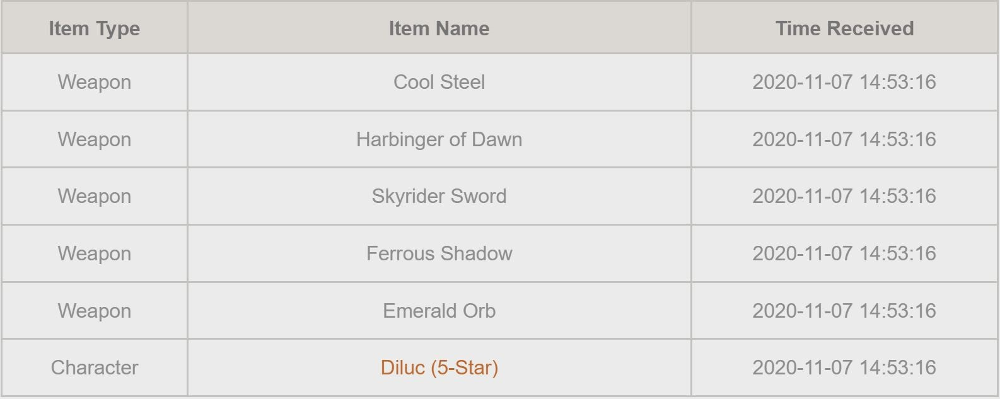
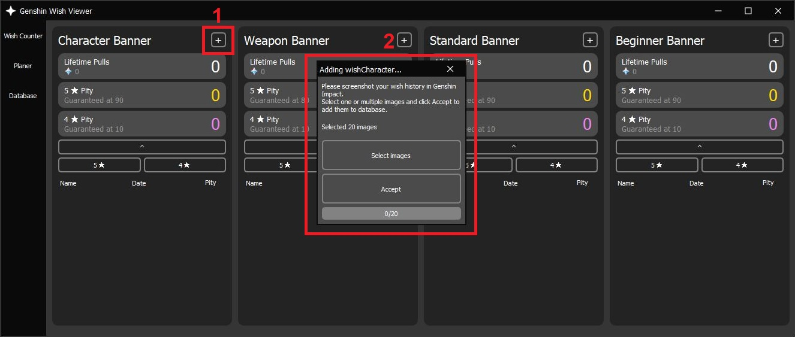
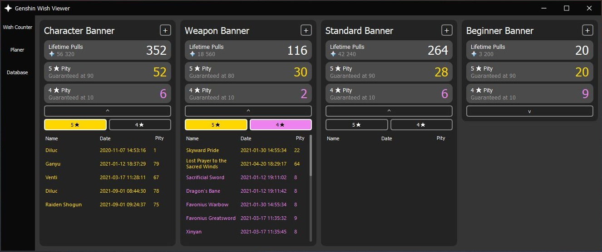

# genshin-wish-viewer

This app is designed to show user more information about wishes, which he did in game: Genshin Impact.

Genshin Impact stores history of wishes for 6 months. So to preserve this information for longer, user could screenshot them to look like this:

And then add them to Genshin Wish Viewer:

This app will OCR image and store it in SQLite3 database. Then user can see more detailed information about them and keep them forever!

